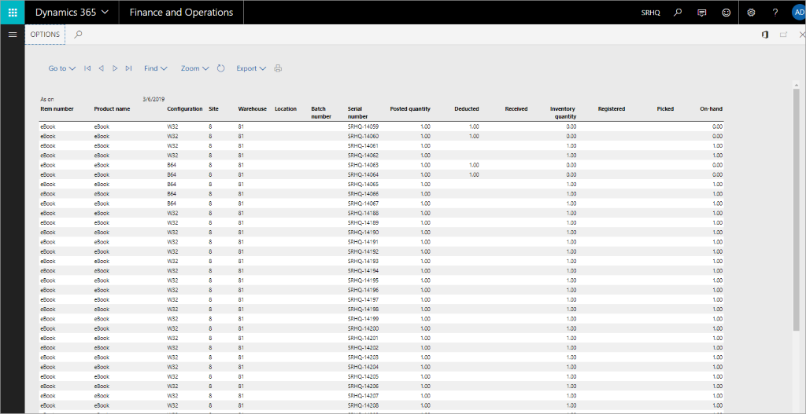

Exercise 1: Use ABC classification report
=========================================

You are asked by your manager at the **USMF** to do some test ABC classification
scenarios on inventory for Jan 2016 since there are some internal investigation
requires to perform analysis on price model of stoked items for 2016. You are
asked to run two ABC classification reports that will show the different
scenarios, with these details:

-   Revenue classifications, with 80 percent (A), 15 percent (B), and 5 percent
    (C)

-   Value classifications, with 20 percent (A), 60 percent (B), and 20 percent
    (C)

To run the ABC Classification report that uses Revenue classifications; 80
percent (A), 15 percent (B), and 5 percent (C), follow these steps:

1.  Navigate to **Inventory management \> Inquiries and reports \>Inventory
    value reports\>ABC classification**.

2.  In the **From date** field, type "01/01/16".

3.  In the **To date** field, type "01/31/16".

4.  In the **A: Highest** field, type "80".

5.  In the **B: Middle** field, type "15".

6.  In the **C: Lowest** field, type "5".

7.  In the **ABC Models** field, click the arrow, and then select Revenue.

8.  Click **OK**. The ABC classification report prints to the screen.

9.  Close the report.

To run the ABC Classification report that uses Value classifications; 20 percent
(A), 60 percent (B), and 20 percent (C), follow these steps:

1.  Navigate to **Inventory management \> Inquiries and reports \>Inventory
    value reports\>ABC classification**.

2.  In the **From date** field, type "01/01/16".

3.  In the **To date** field, type "01/31/16".

4.  In the **A: Highest** field, type "20".

5.  In the **B: Middle** field, type "60".

6.  In the **C: Lowest** field, type "20".

7.  In the **ABC Models** field, click the arrow, and then select Revenue.

8.  Click **OK**. The ABC classification report prints to the screen.

9.  Close the report.

Exercise 2: Use Inventory dimensions report
===========================================

1.  Go to **Inventory management \> Inquiries and reports \> Physical inventory
    reports \> Physical inventory by inventory dimension**.

2.  In the **As on field**, enter today's date

3.  Select Yes in the **Configuration** field.

4.  Select Yes in the **Site** field.

5.  Select Yes in the **Warehouse** field.

6.  Select Yes in the **Location** field.

7.  Select Yes in the **Serial number** field.

8.  Select Yes in the **Batch number** field.

9.  Click **OK**.

10. Your report should look similar to the following:

1.  Close the page.
